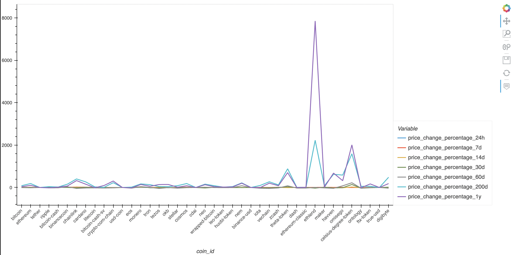
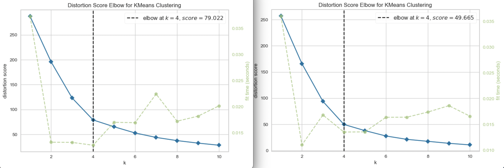
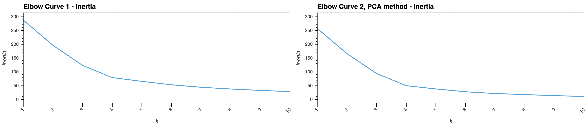
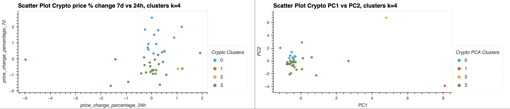

# **Columbia University Engineering, New York FinTech BootCamp** 
# **August 2022 Cohort**
## *Module 10, Challenge - assembling investment portfolios that are based on cryptocurrencies*

Objective - to simulate advisor in one of the top five financial advisory firm. 
Scenario - propose a novel approach to assembling cryptocurrency based investment portfolios utilizing atypical factors that may impact market and result in better performance. 
Product - combine financial Python programming with unsupervised learning to create a Jupyter notebook that clusters cryptocurrencies by their performance in different time periods. Provide visualization/s, i.e. plot the results to demonstrate performance to the board.





---

Supplemental processing and analysis:

Beyond the scope of the assignment, the author sought to conduct additional analysis of the data obtained.  Supplemental and/or extra analysis beyond the scope of the project is noted as 'supplemental' were approrpiate. 

Elbow Method and Silhouette Analysis -
   distortion elbow and silhouette plots were supplemented for the analysis
   




---
## **Methods**
### The code script analysis performed:

    Import the Data from CSV file(provided in the starter code)
    Prepare the Data 
    Find the Best Value for k Using the Original Data
    Cluster Cryptocurrencies with K-means Using the Original Data
    Optimize Clusters with Principal Component Analysis
    Find the Best Value for k Using the PCA Data
    Cluster the Cryptocurrencies with K-means Using the PCA Data
    Visualize and Compare the Results

___






---
## **Technologies**
---
### **Dependencies**

This project leverages Jupyter Lab v3.4.4 and python v3.7 with the following packages:

* [pandas](https://pandas.pydata.org/docs/) - software library written for the python programming language for data manipulation and analysis.

* [hvplot](https://hvplot.holoviz.org/getting_started/hvplot.html) - provides a high-level plotting API built on HoloViews that provides a general and consistent API for plotting data into numerous formats listed within linked documentation.

* [Path](https://pandas.pydata.org/docs/reference/api/pandas.concat.html) - from pathlib - Object-oriented filesystem paths, Path instantiates a concrete path for the platform the code is running on.

* [K-Means](https://scikit-learn.org/stable/modules/clustering.html#k-means) - From scikitlearns cluster, K-Means clustering is one of the most widely used unsupervised machine learning algorithms that form clusters of data based on the similarity between data instances.

* [PCA](https://scikit-learn.org/stable/modules/generated/sklearn.decomposition.PCA.html?highlight=sklearn+decomposition+import+pca) - From scikitlearns decomposition, principal component analysis (PCA); linear dimensionality reduction using Singular Value Decomposition(SVD) of the data to project it to a lower dimensional space, input data is centered but not scaled for each feature before applying the SVD.

* [StandardScaler](https://scikit-learn.org/stable/modules/generated/sklearn.preprocessing.StandardScaler.html?highlight=sklearn+preprocessing+import+standardscaler) - From scikitlearns preprocessing, standardize features by removing the mean and scaling to unit variance.


For additional and / or supplemental processing and visulaization this project also makes use of the following packages:

* [KElbowVisualizer](https://www.scikit-yb.org/en/latest/api/cluster/elbow.html) - from Yellowbrick, implements the “elbow” method to help data scientists select the optimal number of clusters by fitting the model with a range of values for K.

* [SilhouetteVisualizer](https://www.scikit-yb.org/en/latest/api/cluster/silhouette.html?highlight=SilhouetteVisualizer#silhouette-visualizer) - from Yellowbrick, utilize Silhouette Coefficient when the dataset ground-truth is unknown, computes the density of clusters modeled, score is computed by averaging the silhouette coefficient for each sample, computed as the difference between the average intra-cluster distance and the mean nearest-cluster distance for each sample, normalized by the maximum value. This produces a score between 1 and -1, where 1 is highly dense clusters and -1 is completely incorrect clustering.


### **Hardware used for development**

MacBook Pro (16-inch, 2021)

    Chip Appple M1 Max
    macOS Monterey version 12.6

### **Development Software**

Homebrew 3.5.10

    Homebrew/homebrew-core (git revision 0b6b6d9004e; last commit 2022-08-30)
    Homebrew/homebrew-cask (git revision 63ae652861; last commit 2022-08-30)

anaconda Command line client 1.10.0

    conda 22.9.0
    Python 3.9.13

pip 22.2.2 from /opt/anaconda3/envs/jupyterlab_env/lib/python3.9/site-packages/pip (python 3.9)


git version 2.37.2

---
## *Installation of application (i.e. github clone)*

 In the terminal, navigate to directory where you want to install this application from the repository and enter the following command

```python
git clone git@github.com:Billie-LS/ex_machina_crypto_learn.git
```

---
## **Usage**

Recommended operation via virtual environment, environment created and parameters used as below:

```python
> conda create -n <name_env> python=3.9 anaconda
> conda activate <name_env>

	> pip install fire
	> pip install questionary
	> conda update jupyterlab
	> pip install python-dotenv
	> pip install alpaca-trade-api
	> conda install -c pyviz hvplot geoviews
	> conda update conda
	> conda update SQLAlchemy
	> conda install -c conda-forge voila
	> pip install pandas_datareader
	> pip install yellowbrick

```

___

From terminal, the installed application is run through jupyter lab web-based interactive development environment (IDE) interface by typing at prompt:

```python
  > jupyter lab
```

---
## **Project requirements**
### see starter code

---
## **Version control**

Version control can be reviewed at:

```python
https://github.com/Billie-LS/ex_machina_crypto_learn
```

[repository](https://github.com/Billie-LS/Emergency_and_Retirement_Financial_Planner)


---
## **Contributors**

### **Author**

Loki 'billie' Skylizard
    [LinkedIn](https://www.linkedin.com/in/l-s-6a0316244)
    [@GitHub](https://github.com/Billie-LS)


### **BootCamp Classmate Collaboration**

Will Conyea 
    [LinkedIn](https://www.linkedin.com/in/william-conyea-3666a7172/)
    [@GitHub](https://github.com/willco-1)
#####         *ALL primary assignment conducted indpendently, collaboration limited to supplemental materials*

### **BootCamp lead instructor**

Vinicio De Sola
    [LinkedIn](https://www.linkedin.com/in/vinicio-desola-jr86/)
    [@GitHub](https://github.com/penpen86)


### **BootCamp teaching assistant**

Santiago Pedemonte
    [LinkedIn](https://www.linkedin.com/in/s-pedemonte/)
    [@GitHub](https://github.com/Santiago-Pedemonte)


### **askBCS assistants**

Non-participant

### **Additional references**

[StackAbuse](https://stackabuse.com/k-means-elbow-method-and-silhouette-analysis-with-yellowbrick-and-scikit-learn/)

[Geeks for Geeks](https://www.geeksforgeeks.org/elbow-method-for-optimal-value-of-k-in-kmeans/)


---
## **License**

MIT License

Copyright (c) [2022] [Loki 'billie' Skylizard]

Permission is hereby granted, free of charge, to any person obtaining a copy
of this software and associated documentation files (the "Software"), to deal
in the Software without restriction, including without limitation the rights
to use, copy, modify, merge, publish, distribute, sublicense, and/or sell
copies of the Software, and to permit persons to whom the Software is
furnished to do so, subject to the following conditions:

The above copyright notice and this permission notice shall be included in all
copies or substantial portions of the Software.

THE SOFTWARE IS PROVIDED "AS IS", WITHOUT WARRANTY OF ANY KIND, EXPRESS OR
IMPLIED, INCLUDING BUT NOT LIMITED TO THE WARRANTIES OF MERCHANTABILITY,
FITNESS FOR A PARTICULAR PURPOSE AND NONINFRINGEMENT. IN NO EVENT SHALL THE
AUTHORS OR COPYRIGHT HOLDERS BE LIABLE FOR ANY CLAIM, DAMAGES OR OTHER
LIABILITY, WHETHER IN AN ACTION OF CONTRACT, TORT OR OTHERWISE, ARISING FROM,
OUT OF OR IN CONNECTION WITH THE SOFTWARE OR THE USE OR OTHER DEALINGS IN THE
SOFTWARE.


